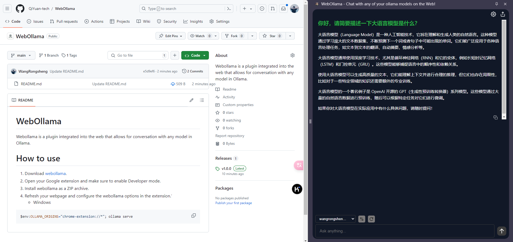
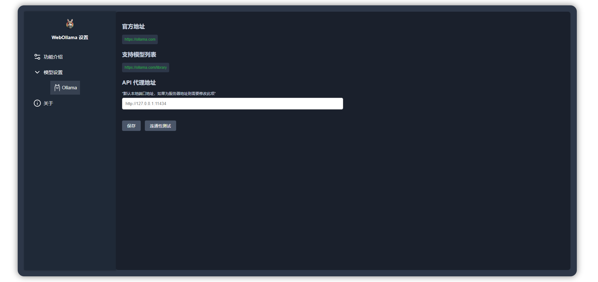

# WebOllama

Webollama is a plugin integrated into the web that allows for conversation with any model in Ollama.
|||
|:-|:-|
|||

# How to use

1. Download [webollama](https://github.com/QiYuan-tech/WebOllama/releases/download/v1.0.0/WebOllama.zip).
2. Open your Google extension and make sure to enable Developer mode.
3. Install webollama as a ZIP archive.
4. Refresh your webpage and configure the webollama options in the extension.‘
   - Windows
   ```python
   $env:OLLAMA_ORIGINS="chrome-extension://*"; ollama serve
   ```
   - Linux
   ```python
   OLLAMA_ORIGINS=chrome-extension://* ollama serve
   ```
